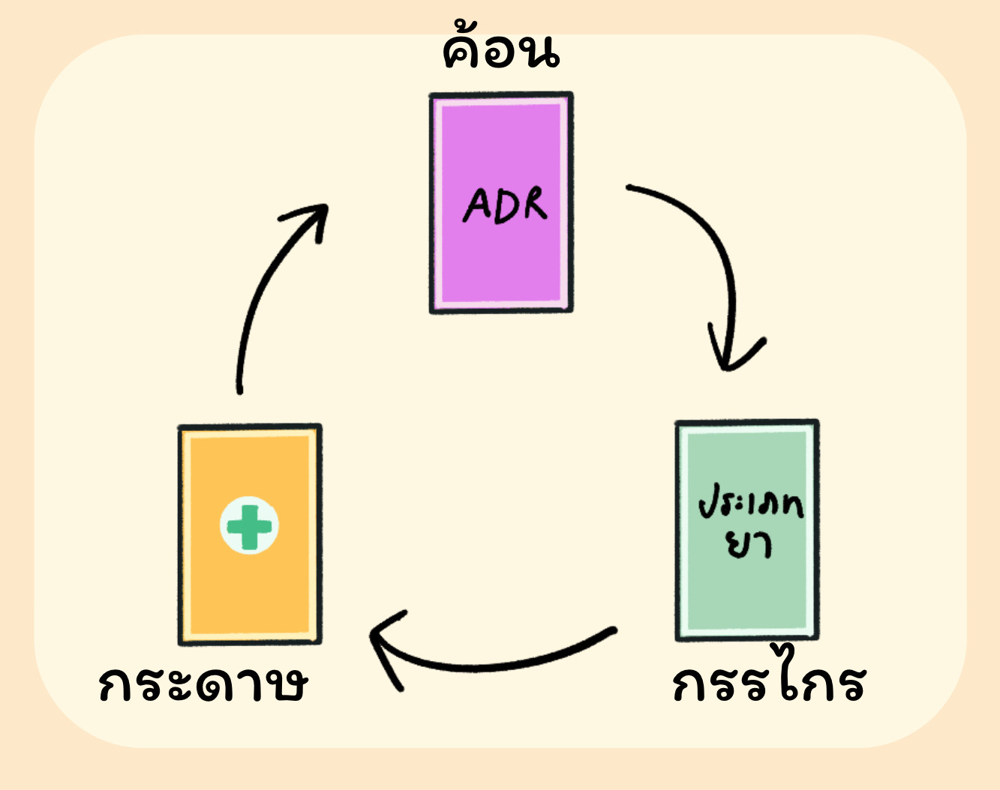

# Deck Maker

- main = find every card combination and make a deck
- medlist = list of all medicine
- sub
	- autorandom = input med card number and output random deck
	- selfinput = input med name and output deck
